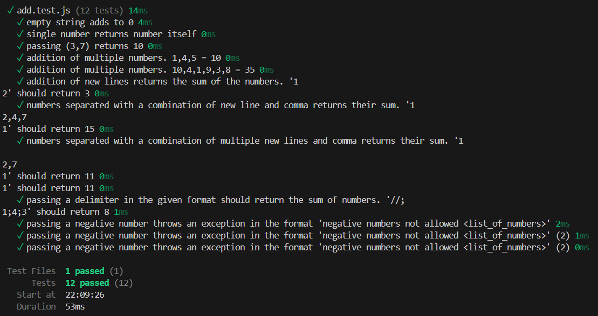

# TDD Assignment - String Calculator



## Overview

This project is a Test-Driven Development (TDD) assignment that implements a string calculator. The calculator can add numbers provided as a string with various delimiters and follows TDD principles where tests are written first, followed by the implementation.

## Features

The string calculator supports the following operations:

### 1. Basic Addition

- **Empty string**: Returns 0
- **Single number**: Returns the number itself
- **Multiple numbers**: Returns the sum of all numbers

### 2. Flexible Delimiters

- **Comma delimiter**: `"1,2,3"` → 6
- **Newline delimiter**: `"1\n2\n3"` → 6
- **Mixed delimiters**: `"1\n2,3"` → 6
- **Multiple consecutive delimiters**: `"1\n\n2,3"` → 6

### 3. Custom Delimiters

- **Custom delimiter format**: `"//[delimiter]\n[numbers]"`
- **Example**: `"//;\n1;2;3"` → 6

### 4. Error Handling

- **Negative numbers**: Throws an exception with the message "negative numbers not allowed" followed by the list of negative numbers
- **Example**: `add("1,-2,-3")` throws "negative numbers not allowed -2,-3"

## Project Structure

```
tdd-assignment/
├── add.js          # Main implementation file
├── add.test.js     # Test cases following TDD principles
├── package.json    # Project configuration and dependencies
├── README.md       # This file
└── image.png       # Project illustration
```

## Installation

1. Clone the repository:

```bash
git clone https://github.com/jainansal/tdd-assignment.git
cd tdd-assignment
```

2. Install dependencies:

```bash
npm install
```

## Usage

### Running Tests

To run the test suite:

```bash
npm test
```

### Using the Calculator

```javascript
import { add } from "./add.js";

// Basic usage
console.log(add("")); // 0
console.log(add("1")); // 1
console.log(add("1,2")); // 3
console.log(add("1\n2,3")); // 6

// Custom delimiter
console.log(add("//;\n1;2;3")); // 6

// Error handling
try {
  add("1,-2");
} catch (error) {
  console.log(error.message); // "negative numbers not allowed -2"
}
```

## Test Cases

The project includes comprehensive test cases that cover:

1. **Empty string handling**
2. **Single number input**
3. **Multiple number addition**
4. **Newline delimiter support**
5. **Mixed delimiter support**
6. **Custom delimiter functionality**
7. **Negative number error handling**

## TDD Approach

This project follows the Test-Driven Development methodology:

1. **Red**: Write a failing test
2. **Green**: Write minimal code to make the test pass
3. **Refactor**: Improve the code while keeping tests green

Each feature was implemented by first writing tests and then implementing the functionality to satisfy those tests.

## Technologies Used

- **JavaScript (ES6+)**: Implementation language
- **Vitest**: Testing framework
- **Node.js**: Runtime environment
